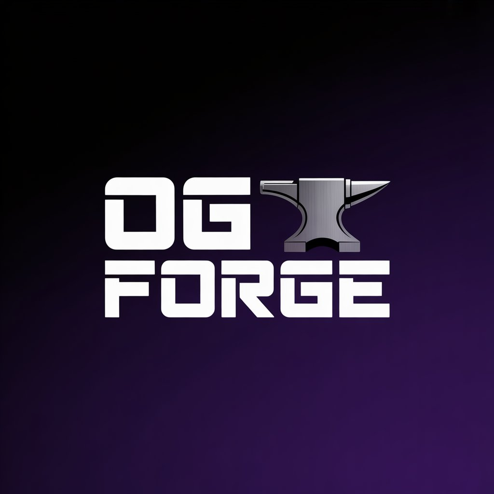

<div align="center">
  <h1>0G Forge</h1>
  

  <p><strong>0G Forge</strong> is a terminal-native agent framework and CLI for building, previewing, and deploying AI-generated apps on the 0G stack — powered by 0G Compute for inference, 0G Storage for persistent memory, and 0G Chain for on-chain registration.</p>

  <p>0G Forge serves as a <strong>ZeroClaw-style framework alternative</strong>: where OpenClaw provides autonomous agent execution loops, 0G Forge provides the code-generation and deployment substrate — a framework primitive that agent builders can use to autonomously scaffold, modify, and ship on-chain AI apps using 0G Compute + Storage.</p>
</div>

## Architecture

```
┌─────────────────────────────────────────────────────┐
│                   Developer / Agent                  │
└─────────────────────┬───────────────────────────────┘
                      │  og CLI commands
                      ▼
┌─────────────────────────────────────────────────────┐
│                  0G Forge CLI (og)                   │
│  og init │ og create │ og edit │ og preview          │
│  og deploy vercel │ og sync push/pull                │
│  og login │ og model list/use                        │
└──────┬─────────────────┬───────────────────┬────────┘
       │                 │                   │
       ▼                 ▼                   ▼
┌──────────────┐ ┌──────────────┐  ┌─────────────────┐
│  0G Compute  │ │  0G Storage  │  │    0G Chain      │
│  Network     │ │  (Indexer +  │  │  FrameworkReg.  │
│  (inference) │ │   KV Layer)  │  │  (EVM contract) │
└──────────────┘ └──────────────┘  └─────────────────┘
       │                 │                   │
       ▼                 ▼                   ▼
 Plan + Diff       Sync metadata        On-chain
 generation        across machines      framework entry
```

```
packages/
  forge-agent/       # Agent runtime — AgentLoop, ToolRegistry, MemoryLayer (NEW)
  core/              # .og manifest + history schema
  compute-client/    # 0G Compute auth + model client
  storage/           # SyncProvider interface + local-file provider
  storage-0g/        # 0G Storage SyncProvider (Indexer + contract)
  deploy-vercel/     # Vercel deploy runner
apps/
  cli/               # og CLI — all commands wired here
contracts/
  FrameworkRegistry  # Solidity — deployed on 0G Chain testnet
examples/
  goal-agent/        # Autonomous agent built on forge-agent runtime
    src/agent.mjs        # basic agent (mock mode)
    src/agent-0g.mjs     # 0G-native agent using forge-agent framework
```

## forge-agent Runtime (`packages/forge-agent/`)

The core framework primitive — a ZeroClaw-style agent runtime built natively on 0G.

```typescript
import { AgentLoop, ToolRegistry, MemoryLayer, createLocalMemoryBackend } from "@og/forge-agent";
import { createOgCreateTool, createOgEditTool, createOgSyncTool } from "@og/forge-agent";

const registry = new ToolRegistry()
  .register(createOgCreateTool({ cliEntry, tsxBin, projectDir, apply: true }))
  .register(createOgEditTool({ cliEntry, tsxBin, projectDir, apply: true }))
  .register(createOgSyncTool({ cliEntry, tsxBin, projectDir }));

const memory = new MemoryLayer(createLocalMemoryBackend("./state.json"), "my-agent");

const loop = new AgentLoop({
  registry,
  memory,
  maxRetries: 2,
  onStepEnd(reflection) {
    console.log(`${reflection.decision}: ${reflection.goal}`);
  }
});

loop
  .addGoal("Create a landing page with hero section", "og:create")
  .addGoal("Improve accessibility and contrast", "og:edit")
  .addGoal("Add feature list below hero", "og:edit");

const result = await loop.run();
// { goalsCompleted: 3, goalsSkipped: 0, reflections: [...] }
```

Three extensible primitives:
- **`AgentLoop`** — goal execution engine with reflection (continue / retry / skip / abort)
- **`ToolRegistry`** — register any tool; built-ins wrap `og create`, `og edit`, `og sync`
- **`MemoryLayer`** — read/write/append agent state; backend-agnostic (local file or 0G Storage)

## Install

```bash
npm install -g @kaptan_web3/og-cli
og --version
og --help
```

## Quick start

### 1) Login with 0G Compute credentials

```bash
og login \
  --token "$OG_COMPUTE_TOKEN" \
  --endpoint "https://compute.0g.ai"
```

### 2) Init a project

```bash
og init --template react-vite --dir ./my-app --yes
cd ./my-app && pnpm install
```

### 3) Generate from a prompt

```bash
og create --prompt "Add a hero section with gradient background" --dry-run
og create --prompt "Add a hero section with gradient background" --yes
```

### 4) Edit → preview → deploy

```bash
og edit --prompt "Improve CTA contrast and add mobile nav" --yes
og preview
og deploy vercel --yes
```

### 5) Sync metadata to 0G Storage

```bash
# Set env vars (see .env.example in contracts/)
export OG_STORAGE_ENABLED=1
export OG_STORAGE_INDEXER_RPC=https://indexer-storage-testnet-standard.0g.ai
export OG_PRIVATE_KEY=<your_key>
export OG_REGISTRY_CONTRACT=<deployed_contract_address>

og sync push   # uploads payload to 0G Storage, stores hash on 0G Chain
og sync pull   # reads hash from chain, downloads from 0G Storage
```

## 0G Protocol Integration

| Component | Usage |
|---|---|
| **0G Compute Network** | AI inference for `og create` / `og edit` — OpenAI-compatible `/v1/chat/completions` |
| **0G Storage (Indexer)** | `og sync push/pull` stores project metadata as files on 0G Storage network |
| **0G Chain (EVM)** | `FrameworkRegistry` contract stores latest sync hash per project + framework registration |

## Goal Agent — Autonomous example

The goal agent (`examples/goal-agent/`) is a working autonomous agent built **on top of** the og framework. It demonstrates how developers can use og as an agent substrate.

```bash
# Basic (mock mode)
node examples/goal-agent/src/agent.mjs --apply

# 0G-native (uses 0G Storage memory + 0G Chain registration + reflection loop)
OG_STORAGE_ENABLED=1 \
OG_STORAGE_INDEXER_RPC=<rpc> \
OG_PRIVATE_KEY=<key> \
OG_REGISTRY_CONTRACT=<address> \
node examples/goal-agent/src/agent-0g.mjs --apply --max-steps 3
```

What the 0G-native agent does:
- Reads goal list
- Runs `og create` / `og edit` for each goal
- **Reflection loop**: evaluates each step result before continuing (retry / skip / continue)
- Writes memory to 0G Storage after each step
- Registers itself on 0G Chain via `FrameworkRegistry`

## Contract Deployment (0G Chain)

```bash
cd contracts
npm install
cp .env.example .env  # fill in OG_PRIVATE_KEY
npm run deploy:testnet
```

The deploy script also registers "0G Forge" on-chain automatically.

**Deployed contract:** see `HACKATHON_SUBMISSION.md` for the live address.

## Environment variables

```bash
# 0G Compute (required for real generation)
OG_COMPUTE_TOKEN=          # your compute API token
OG_COMPUTE_ENDPOINT=       # default: https://compute.0g.ai

# 0G Storage sync (optional, enables decentralized sync)
OG_STORAGE_ENABLED=1
OG_STORAGE_INDEXER_RPC=    # e.g. https://indexer-storage-testnet-standard.0g.ai
OG_EVM_RPC=                # default: https://evmrpc-testnet.0g.ai
OG_PRIVATE_KEY=            # wallet key for signing storage + chain txs
OG_REGISTRY_CONTRACT=      # deployed FrameworkRegistry address

# Developer mock mode (local testing only)
OG_ENABLE_MOCK_MODE=1      # enables mock://local endpoint
```

## Run from source

```bash
git clone <repo-url>
cd 0G
pnpm install
pnpm build
pnpm --filter @og/cli run dev --help
```

## Validation

```bash
pnpm lint
pnpm typecheck
pnpm build
```

## Repository map

```text
apps/cli/              # CLI — all og commands
packages/core/         # .og state (manifest, history)
packages/compute-client/ # 0G Compute auth + model client
packages/storage/      # SyncProvider interface + local-file provider
packages/storage-0g/   # 0G Storage SyncProvider (NEW)
packages/deploy-vercel/ # Vercel deploy runner
contracts/             # FrameworkRegistry.sol — 0G Chain (NEW)
examples/goal-agent/   # Autonomous agent example
  src/agent.mjs        # basic version (mock)
  src/agent-0g.mjs     # 0G-native version with reflection (NEW)
scripts/demo-flow.sh   # reproducible demo runner
```

## Supported templates

`react-vite` · `nextjs-app` · `static-landing`

## Commands

```text
og login / logout / whoami
og model list / model use <modelId>
og init
og create / og edit
og preview
og deploy vercel
og sync push / og sync pull
og doctor
```
