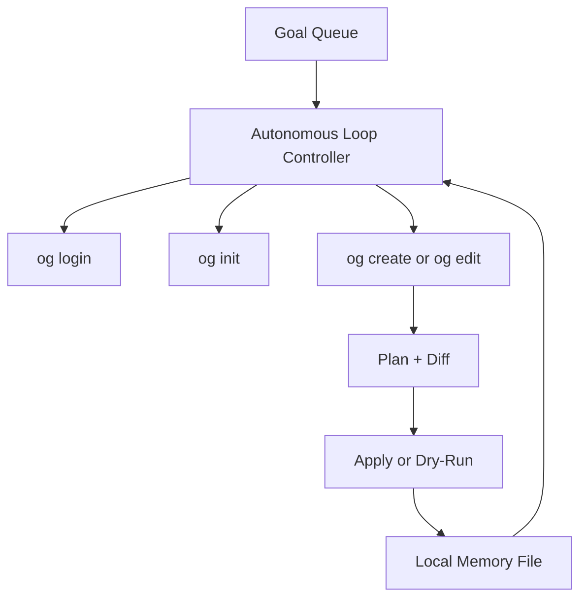

# Goal Agent Architecture

## Components

- **Loop Controller:** `examples/goal-agent/src/agent.mjs`
- **Framework Tooling:** `apps/cli/src/index.ts`
- **Compute Integration:** `packages/compute-client/src/compute-client.ts`
- **Memory/Sync Layer:** `packages/storage/src/index.ts`

## Autonomous Behavior

- Reads goal list
- Chooses create/edit phase automatically by iteration index
- Executes task through the framework commands
- Writes memory after each step
- Pushes metadata sync after each step
